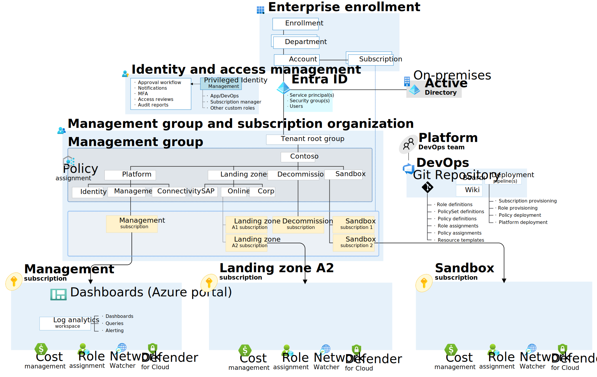

# Azure Landing Zones Demo

Demonstration of various infrastructure as code and pipeline components to deploy [Azure Landing Zones](https://learn.microsoft.com/en-us/azure/cloud-adoption-framework/ready/landing-zone/).

The rationale behind this can be found here [A simplified Azure Landing Zones alternative](https://ondfisk.dk/a-simplified-azure-landing-zones-alternative/).

## Azure landing zone conceptual architecture



The conceptual architecture is greatly simplified compared to the official one, as we empower DevOps teams to build and run their own thing.

We do not want to manage network from a centralized perspective. All applications will be deployed as islands with no inter-network connectivity.

We adopt a [Zero Trust](https://learn.microsoft.com/en-us/security/zero-trust/zero-trust-overview) approach where identity and encryption trumps and often replaced _Network Security_.

We do not require nor encourage the use of [Azure Private Link](https://azure.microsoft.com/en-gb/products/private-link/).

We allow most services to have _Public Network Access_: _Enabled_ because we rely on enforcing _Entra ID_ authentication and TLS encryption.

## Online Landing Zones

These are the most important landing zones - all _newer_ applications should be deployed here - even if data resides on-premises.

Connection to on-premises resources should be managed using zero-trust approaches with resources like:

- [Azure Relay](https://learn.microsoft.com/en-us/azure/azure-relay/)
- [Azure Service Bus](https://learn.microsoft.com/en-us/azure/service-bus-messaging/)
- [Azure API Management](https://learn.microsoft.com/en-us/azure/api-management/)
- [Azure Arc](https://azure.microsoft.com/en-us/products/azure-arc/)

## Corp Landing Zones

Corp landing zones should exclusively be used for lift-and-shift scenarios (and avoided all together if possible). This is reserved for applications which do not support modern authentication and relies on Kerberos (Windows Active Directory).

## Policy-driven Governance

The primary focus is on [Policy-driven governance](https://learn.microsoft.com/en-us/azure/cloud-adoption-framework/ready/landing-zone/design-principles#policy-driven-governance).

## Code

```bash
.
├───.github
│   ├───linters
│   └───workflows
├───docs
├───environments                    # Parameters and variables
│   ├───canary
│   └───prod
└───modules
    ├───management                  # Deploy management subscription resources
    ├───management-groups           # Deploy management group structure
    ├───policies                    # Deploy policies
    │   ├───assignments
    │   ├───initiatives
    │   ├───policies
    │   └───scripts
    └───shared                      # Shared bicep modules
```

## Continuous Deployment

Landing zones are deployed using GitHub Actions.

## Notes

1. To lint repository locally (from WSL) run:

   ```bash
   docker run -e DEFAULT_BRANCH=main -e RUN_LOCAL=true -e VALIDATE_GIT_COMMITLINT=false -e VALIDATE_JSCPD=false -e FIX_YAML_PRETTIER=true -e FIX_JSON=true -e FIX_JSON_PRETTIER=true -e FIX_JSONC=true -e FIX_JSONC_PRETTIER=true -eFIX_MARKDOWN=true -e FIX_MARKDOWN_PRETTIER=true -e FIX_POWERSHELL=true -eFIX_YAML_PRETTIER=true -v .:/tmp/lint --rm ghcr.io/super-linter/super-linter:latest
   ```

1. The installed _Azure Policy_ extension for Visual Studio Code is referencing the deprecated _Azure Account_ extension. Ignore for now.
