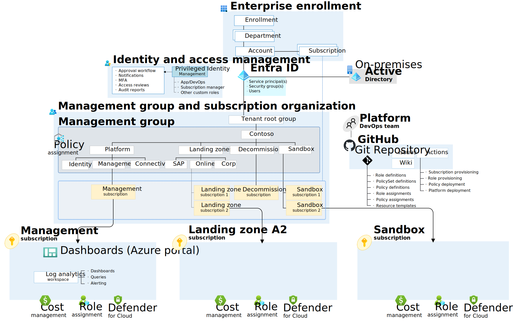

# Azure Landing Zones Demo

Demonstration of various infrastructure as code and pipeline components to deploy [Azure Landing Zones](https://learn.microsoft.com/en-us/azure/cloud-adoption-framework/ready/landing-zone/).

## Azure landing zone conceptual architecture



The conceptual architecture is greatly simplified as we focus on empowering DevOps teams to build their own thing.

We do not want to manage network from a centralized perspective. All applications will be deployed as islands with no inter-network connectivity.

## Online Landing Zones

These are the most important landing zones - all *newer* applications should be deployed here - even if data resides on-premises.

Connection to on-premises resources should be managed used zero-trust based approaches with resources like:

- [Azure Relay](https://learn.microsoft.com/en-us/azure/azure-relay/)
- [Azure Service Bus](https://learn.microsoft.com/en-us/azure/service-bus-messaging/)
- [Azure API Management](https://learn.microsoft.com/en-us/azure/api-management/)
- [Azure Arc](https://azure.microsoft.com/en-us/products/azure-arc/)

## Corp Landing Zones

Corp landing zones should exclusively be used for lift-and-shift scenarios (and avoided all together if possible). This is reserved for applications which do not support modern authentication and relies on Windows Active Directory.

## Policy-driven Governance

The primary focus is on [Policy-driven governance](https://learn.microsoft.com/en-us/azure/cloud-adoption-framework/ready/landing-zone/design-principles#policy-driven-governance).

## Code

```bash
.
├───.github
│   ├───linters
│   └───workflows
├───docs
├───environments                    # Parameters and variables
│   ├───canary
│   └───prod
└───modules
    ├───management                  # Deploy management subscription resources
    ├───management-groups           # Deploy management group structure
    ├───policies                    # Deploy policies
    │   ├───assignments
    │   ├───initiatives
    │   ├───policies
    │   └───scripts
    └───shared                      # Shared bicep modules
```

## Continuous Deployment

Landing zones are deployed using GitHub Actions.
